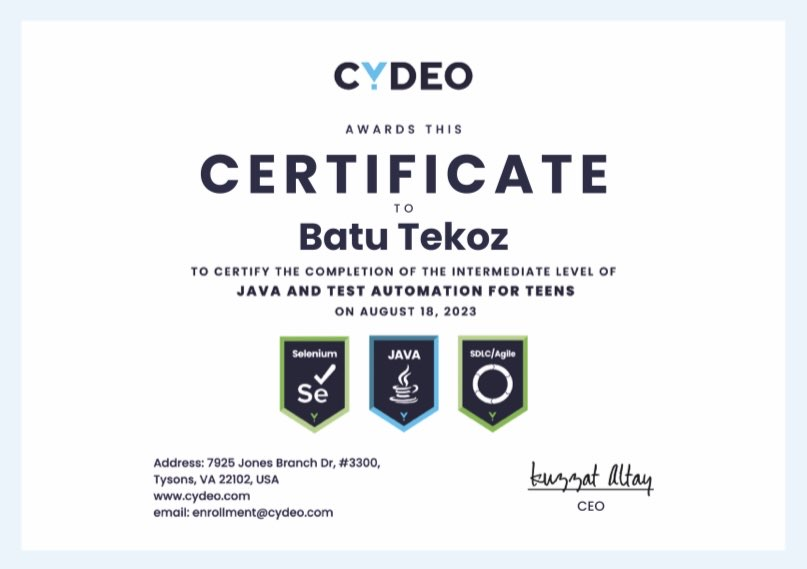

# 👋 Hi, I'm Batu Teköz

💻 **C++ Backend Developer**  
⚡ Building high-performance real world projects, game servers and security solutions

---

## 🔧 Tech Stack

---

## 🚀 Featured Projects
- 🎮 [Power Arena 2D](https://github.com/batutekoz77/Power-Arena-2D)  
  *Fast-paced multiplayer 2D battle game built with C++, ENet & Raylib.*

- 🔗 [Real World SQL Web](https://github.com/batutekoz77/Real-World-SQL-Web)  
  *An enterprise-oriented web application built with the Crow C++ framework and SQLite, featuring announcements, task management, and employee database operations in one solution.*

- 💵 [Crypto Analyzer Web](https://github.com/batutekoz77/Crypto-Analyzer-Web)  
  *A web-based crypto dashboard built with HTML, CSS, and JavaScript, featuring real-time market updates, coin-specific news, Google login integration, and subscription management.*

---

## 🏆 Certificate

---

## 📊 GitHub Stats
  

---

## 📫 Contact
- [Email](#batutekoz@gmail.com)
- [Whatsapp](#+31622266035)
